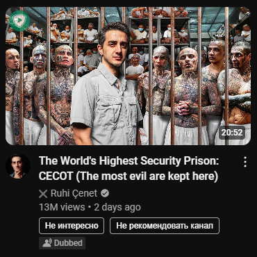

# YouTube Quick Actions
Добавляет кнопки быстрого действия 'Не интересно' и 'Не рекомендовать канал' на превьюшки

## Установка
1. Откройте `chrome://extensions/` в браузере Chrome
2. Включите "Режим разработчика" (переключатель в правом верхнем углу)
3. Скачайте ZIP-архив:
    - Нажмите на зеленую кнопку "Code" на GitHub
    - Выберите "Download ZIP"
    - Распакуйте скачанный ZIP-файл
4. Нажмите "Загрузить распакованное расширение" на странице расширений Chrome
5. Выберите папку с файлами расширения

## После установки
- Перейдите на любую страницу YouTube
- Под каждым видео вы увидите две новые компактные кнопки:
    - "Не интересно"
    - "Не рекомендовать канал"
- Эти кнопки помогут вам быстро фильтровать нежелательный контент

## Обновление
При появлении обновлений:
1. Скачайте последнюю версию, повторив те же шаги
2. Нажмите на значок обновления на карточке расширения на странице расширений Chrome

Не стесняйтесь создавать issue или участвовать в развитии 'проекта'!

----

## Installation Steps
1. Go to `chrome://extensions/` in your Chrome browser
2. Enable "Developer mode" (toggle switch in the top-right corner)
3. Download ZIP:
    - Click the green "Code" button on GitHub
    - Select "Download ZIP"
    - Extract the downloaded ZIP file
4. Click "Load unpacked" in Chrome extensions page
5. Select the folder containing the extension files

## After Installation
- Navigate to any YouTube page
- You'll see two new compact buttons under each video:
    - "Not interested"
    - "Don't recommend channel"
- These buttons help you quickly filter unwanted content

## Updating
If there are new updates:
1. Download the latest version using the same steps
2. Click the refresh icon on the extension card in Chrome extensions page

Feel free to create issues or contribute to the project!